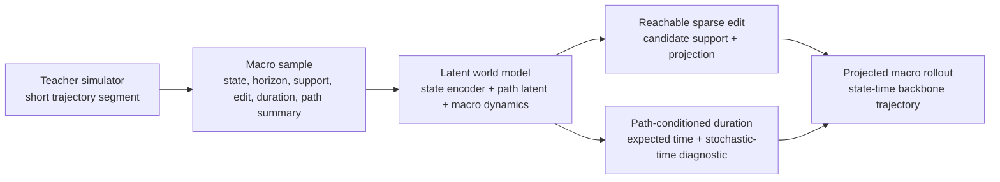

# AtomWorld-Mirror

**Macro-Step World Modeling of Critical Evolution Backbones for Materials Dynamics**

AtomWorld-Mirror is a research codebase for learning state-time macro rollouts in atomistic materials evolution. Instead of replaying every low-impact microscopic update, the project learns a physically constrained latent world model that advances along sparse, future-relevant structural waypoints.

The repository is designed to support the paper narrative: long-horizon materials simulation is limited not only by compute, but by **evolutionary resolution**. The important question is how to skip unnecessary microscopic detail while preserving reachable structure, inventory, and physical time.

## Overview

Conventional atomistic simulation usually represents evolution through explicit time stepping or micro-event updates. This stepwise view treats different state changes uniformly, even though only some changes accumulate into persistent structural progress. Before a trajectory reaches structurally consequential configurations, much of the budget can be spent on low-impact intermediate updates.

AtomWorld-Mirror addresses this **evolutionary-resolution bottleneck** by learning the **critical evolution backbone**: a sparse sequence of future-relevant states that carries persistent structural progress. Each macro step predicts a physically reachable sparse structural edit, the accumulated physical duration of that transition, and the next latent state for continued rollout.

## Key Features

- **Teacher simulator supervision** for short atomistic trajectory segments.
- **Latent world model rollout** for state-time macro transitions.
- **Reachable sparse edits** instead of dense whole-lattice reconstruction.
- **Path-conditioned physical duration** instead of endpoint-only time regression.
- **Projection-based validity checks** for reachability, inventory, and closed-loop rollout.
- **Controlled Multi-K horizons** for bounded macro-step prediction.

## Architecture



A supervised macro sample contains:

```text
(X_t, k, X_{t+k}, Delta X_{t:t+k}, tau_exp, tau_real, s_path, C_k)
```

where `C_k` is the reachable candidate set, `s_path` summarizes the teacher trajectory, `tau_exp` is the accumulated expected physical duration, and `tau_real` is retained as an auxiliary stochastic-time diagnostic.

The default horizon set is bounded:

```text
K = {2, 4, 8}
```

This keeps the system focused on controlled Multi-K macro world modeling rather than unconstrained key-state discovery.

## Physical Constraints

| Constraint | Role |
| --- | --- |
| Local reachability | Macro edits are restricted to candidate supports derived from locally reachable teacher simulator dynamics. |
| Inventory conservation | Projection preserves valid atom and vacancy counts. |
| Continuous-time consistency | Physical duration is learned as a path-conditioned quantity, with `tau_exp` as the main target. |

These constraints make the model a **state-time macro transition model**, not a dense reconstructor, a plain next-state predictor, or a pure speed shortcut.

## Installation

Use a Python environment that can run the project dependencies, then install the requirements:

```bash
python -m pip install --upgrade pip
python -m pip install -r requirements.txt
```

See [Setup notes](dependencies.md) for environment details and smoke-check guidance.

## Usage

The repository workflow has four main stages:

1. Build macro samples from teacher simulator trajectory segments.
2. Train the latent world model on reachable sparse edits and physical duration.
3. Evaluate paired macro-step alignment against teacher segments.
4. Run closed-loop rollout diagnostics with projection and timing checks.

Large generated datasets, checkpoints, manuscript files, and final figure assets are kept outside the public README path. The README therefore documents the public-facing workflow and the paper narrative rather than linking private local artifacts.

## Evaluation

| Evidence | Question |
| --- | --- |
| Figure 1 | Why fixed microscopic replay budget is poorly aligned with sparse key structural evolution. |
| Figure 2 | Whether paired macro steps match teacher sparse edits and expected physical duration. |
| Figure 3 | Whether closed-loop rollouts remain reachable, inventory-preserving, and temporally calibrated under ablations. |
| Figure 4 | Whether macro inference provides timed end-to-end speedups after validity checks. |

The timing claim is reported as a **timed end-to-end diagnostic** after edit validity, closed-loop stability, and duration alignment are checked.

## Repository Scope

This repository is organized around the macro-step world-modeling claim. It does not include private manuscript source files, submission PDFs, final figure assets, large local result directories, or historical experiment branches that are unnecessary for the minimal public workflow.

## 中文说明

AtomWorld-Mirror 是一个服务论文叙事的材料演化宏步世界模型仓库。README 的入口不从某个具体模拟器或具体模型实现名开始，而是从论文 Introduction 的问题链展开：

传统 atomistic simulation 通常通过 explicit time stepping 或 micro-event updates 描述演化。这种逐步推进方式会把不同状态变化一视同仁，但长时程演化中有些变化只是低影响局部扰动，另一些变化才会积累成持续结构进展。系统在到达真正结构性关键状态之前，可能把大量预算花在中间更新上。论文把这个问题称为 **evolutionary-resolution bottleneck**。

AtomWorld-Mirror 的目标是学习 **critical evolution backbone**：保留那些对未来演化有约束作用的稀疏关键状态，而不是复制完整微观轨迹。模型从当前构型出发，预测下一段物理可达的 backbone transition，把它解码成 reachable sparse edit，并预测这段转移累计的 physical duration。

### 中文方法概览

每个宏步同时预测三个对象：

- 物理上可达的 sparse lattice edit；
- 该宏步累计的 physical duration；
- 用于继续 rollout 的 next macro latent state。

公开 README 采用 **teacher simulator / latent world model** 分工：teacher simulator 提供短程原子演化片段、candidate support、path summary 和时间监督；latent world model 学习 backbone-aware macro rollout。默认 `K={2,4,8}` 是受控 Multi-K horizon 集合，不是无界 key-state discovery。

### 中文物理约束

| 约束 | 含义 |
| --- | --- |
| Local reachability | 宏步不能任意改 lattice；编辑只能落在局部可达 teacher simulator dynamics 给出的候选支持内。 |
| Inventory conservation | projection 后 atom / vacancy 数量保持合法。 |
| Continuous-time consistency | 宏步时间是 path-conditioned quantity，主监督为 `tau_exp`，`tau_real` 只作为随机时间辅助诊断。 |

因此，AtomWorld-Mirror 的输出不是全 lattice dense reconstruction，也不是普通下一状态预测；它输出的是 **受可达性约束的稀疏晶格编辑 + 累计物理时间 + 下一个宏步 latent state**。

### 中文评估口径

- Figure 1：说明固定 microscopic replay budget 与关键结构演化发生时刻不匹配。
- Figure 2：检查 paired macro-step validation，即结构编辑和期望物理时间是否对齐 teacher。
- Figure 3：检查 closed-loop rollout 和三条物理约束的消融。
- Figure 4：在上述有效性检查之后，再报告 timed end-to-end speedup。

README 只保留公开 GitHub 首页需要的信息，不写历史实验编号、调试过程或流水账。

## License

This repository is released under the MIT License. See [LICENSE](LICENSE) for details.
